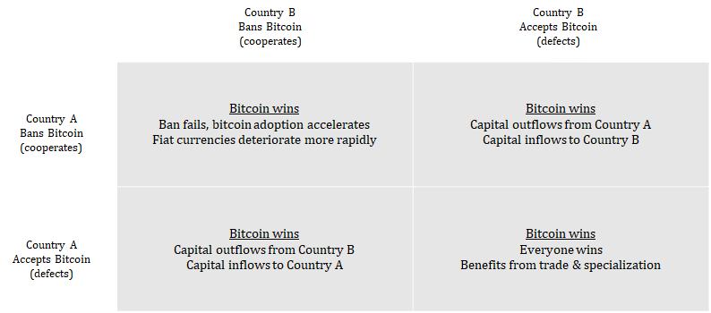
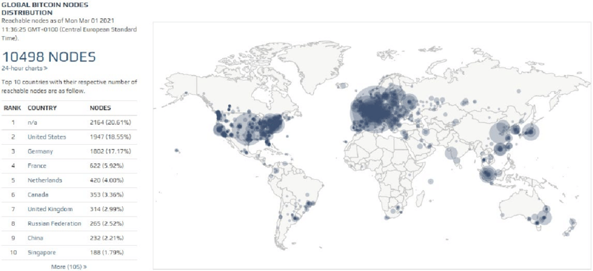

## Why localize-bitcoin

"Bitcoin is a strange game where the only winning move is to play." @bitstein

Do the people in other countries know they are in the middle of the game?

"I really think that in many ways, **Bitcoin, at least for now, is too English language centric** and Western development centric to really be able to offer that relief valve." - Andreas Antonopolous 

localize-bitcoin aims to ignite Bitcoin's unstoppable global game theory by localizing Bitcoin information and tools into as many languages as possible.

[Parker Lewis: Bitcoin Cannot Be Banned](https://unchained-capital.com/blog/bitcoin-cannot-be-banned/)

Three things everyone around the world should know in their own tongue:
1. Understand bitcoin
2. Self-custody bitcoin
3. Run a full node

I once hosted a website called localizebitcoin.com, but since took it offline due to other life responsibilities. But I've re-uploaded my translation memory and terminology data to this repository. The links below are somewhat outdated, but direct translators to worthwhile Bitcoin development projects.

## Bisq

[Twitter](https://twitter.com/bisq_network)  
[Translate on Transifex](https://www.transifex.com/bisq/)  

## Bitcoin.org

[Translate on Transifex](https://www.transifex.com/bitcoinorg/bitcoinorg/dashboard/)

## Bitcoin Core

[Twitter](https://twitter.com/bitcoincoreorg)  
[Translation Process](https://github.com/bitcoin/bitcoin/blob/master/doc/translation_process.md)  
[Translate on Transifex](https://www.transifex.com/bitcoin/bitcoin/dashboard/)  

## Electrum Wallet

[Twitter](https://twitter.com/ElectrumWallet)  
[Translate on CrowdIn](https://crowdin.com/project/electrum)  

## Mastering Bitcoin by Andreas Antonopolous

[Translate on Transifex](https://www.transifex.com/aantonop/mastering-bitcoin/dashboard/)  
[Translations](https://bitcoinbook.info/translations-of-mastering-bitcoin/)  

### Open Second Edition (2017)
The second edition of Mastering Bitcoin was released in 2017 and contains 30% more content as well as a rewrite of several sections.

[Spanish $20.00](https://aantonop.com/product/dominando-el-bitcoin-abierta-segunda-edicion-spanish-ebook/)  
[Romanian $20.00](https://aantonop.com/product/mastering-bitcoin-open-a-doua-editie-romanian-ebook/)  
[Romanian Volunteer Translation Free PDF](https://2r2og341hhe548yjao1hwizx-wpengine.netdna-ssl.com/wp-content/uploads/book.pdf)  

### OLD - Open First Edition (2014)
The first edition was released in 2014 - it is now OBSOLETE. The second edition was released in 2017. Translations are ongoing...  
[Spanish](https://bitcoinbook.info/wp-content/translations/es/book.pdf)  
[Chinese](https://bitcoinbook.info/wp-content/translations/cmn/book.pdf)  
[Brazilian Portuguese](https://bitcoinbook.info/wp-content/translations/pt_BR/book.pdf)  
[Japanese](https://bitcoinbook.info/wp-content/translations/ja/book.pdf)  
[French (incomplete)](https://bitcoinbook.info/wp-content/translations/fr/book.pdf)  
[Russian (incomplete)](https://bitcoinbook.info/wp-content/translations/ru/book.pdf)  
[Italian (incomplete)](https://bitcoinbook.info/wp-content/translations/it/book.pdf)  
[Greek](https://bitcoinbook.info/wp-content/translations/el/book.pdf)  
[Czech](https://bitcoinbook.info/wp-content/translations/cs/book.pdf)  
[Hungarian](https://bitcoinbook.info/wp-content/translations/hu/book.pdf)  

## The Bullish Case for Bitcoin by Vijay Boyapati

[English](https://vijayboyapati.medium.com/the-bullish-case-for-bitcoin-6ecc8bdecc1)  
[German](https://medium.com/@danielschnurr089/das-bullische-argument-f%C3%BCr-bitcoin-9665e9375727)  
[Korean Part 1](https://medium.com/@hyungjoh/https-medium-com-hyungjoh-the-bullish-case-for-bitcoin-part-1-of-4-korean-7e454dc539bc)  
[Korean Part 2](https://medium.com/@hyungjoh/https-medium-com-hyungjoh-the-bullish-case-for-bitcoin-part-2-of-4-korean-c540ff608f11)  
[Korean Part 3](https://medium.com/@hyungjoh/https-medium-com-hyungjoh-the-bullish-case-for-bitcoin-part-3-of-4-58ba827992b4)  
[Korean Part 4](https://medium.com/@hyungjoh/https-medium-com-hyungjoh-the-bullish-case-for-bitcoin-part-4-of-4-a1d3293e023e)  
[Traditional Chinese Part 1](https://medium.com/@sunflora98/%E6%AF%94%E7%89%B9%E5%B9%A3%E7%9C%8B%E6%BC%B2%E8%AB%96-%E4%B8%80-33d753d60fa0)  
[Traditional Chinese Part 2](https://medium.com/@sunflora98/%E6%AF%94%E7%89%B9%E5%B9%A3%E7%9C%8B%E6%BC%B2%E8%AB%96-%E4%BA%8C-6e8f31272bbd)  
[Traditional Chinese Part 3](https://medium.com/@sunflora98/%E6%AF%94%E7%89%B9%E5%B9%A3%E7%9C%8B%E6%BC%B2%E8%AB%96-%E4%B8%89-6cdc512302d5)  
[Traditional Chinese Part 4](https://medium.com/@sunflora98/%E6%AF%94%E7%89%B9%E5%B9%A3%E7%9C%8B%E6%BC%B2%E8%AB%96-%E5%9B%9B-e45de99f75e7)

